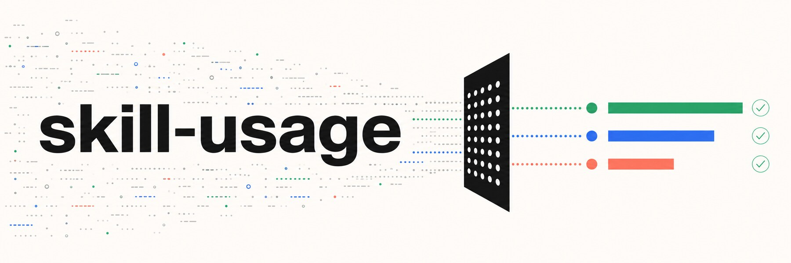

<div align="center">



# skill-usage

**不要把“出现在提示词里”误当成“真正被调用过”。**

[](CHANGELOG.md)
[](#隐私边界)
[](#四类输出)
[](#直接运行扫描器)
[](LICENSE)

[快速开始](#快速开始) · [统计口径](#统计口径) · [覆盖范围](#覆盖范围) · [隐私边界](#隐私边界)

</div>

## 一份 Skill 排名，最容易错在统计开始之前

Agent 的系统提示、权限清单、路径表、README 和缓存里可能反复出现 Skill 名称。简单地全文搜索然后排序，会把“被列出来很多次”包装成“被真正使用很多次”。

`skill-usage` 是一个本地优先的 AI Agent Skill 使用审计工具。它会发现不同客户端的会话来源，区分真实调用证据与噪声提及，再输出可复查的排名、覆盖审计和整理建议。

它关注的不是一个漂亮数字，而是三个更难的问题：

1. 到底扫描了哪些会话来源？
2. 什么证据才算一次真实调用？
3. 哪些结果仍然存在未知或混合噪声？

## 快速开始

```bash
git clone https://github.com/DOIT-Ben/skill-usage.git
```

将仓库作为 Skill 安装到支持本地 Skill 的 Agent，然后直接说：

```text
用 skill-usage 统计全部 Skills 的真实调用量，给我主榜、补充榜、噪声说明和整理建议。
```

也可以追问：

```text
为什么这个 Skill 的 wideMentions 很高，但 strictCalls 很低？它是触发描述有问题，还是只有系统提示噪声？
```

## 直接运行扫描器

```powershell
$skill = "<path-to-skill-usage>"
$env:OUTPUT_DIR = (Get-Location).Path
Remove-Item Env:\INCLUDE_SQLITE -ErrorAction SilentlyContinue
python "$skill\scripts\deep_skill_usage_scan.py"
```

扫描默认在本地完成，不上传日志，也不会把原始会话内容写进报告。

## 统计口径

| 字段 | 它实际代表什么 | 是否进入主榜 |
| --- | --- | --- |
| `strictCalls` | 存在明确执行上下文的 Skill 加载或调用证据 | 是，主排名依据 |
| `strictSessions` | 出现真实调用证据的去重会话数 | 是，用于判断稳定性 |
| `wideMentions` | 出现在提示词、路径、文档、列表或缓存中的提及 | 否，只作为需求与噪声信号 |
| `rawRefs` | 去重前的原始引用次数 | 否，仅诊断使用 |
| `realRatio` | `strictCalls / wideMentions` | 否，用于识别触发质量或噪声 |

`wideMentions` 很高不等于调用很多。`strictCalls = 0` 也不等于应该立即删除，它可能是新安装、低频但关键、依赖型或战略性 Skill。

## 四类输出

每次完整审计都会生成：

| 文件 | 内容 |
| --- | --- |
| `skill-usage-deep-report.json` | 完整结构化统计与覆盖信息 |
| `skill-usage-ranking-deep.md` | 适合阅读和评审的排名报告 |
| `skill-usage-ranking-deep.csv` | 适合筛选、比较和二次分析的数据 |
| `skill-usage-source-audit.md` | 扫描来源、遗漏来源、噪声与未知边界 |

报告应同时包含主排名、扩展会话排名、来源发现审计和整理建议。只有排名，没有来源审计，不算可靠结果。

## 覆盖范围

主榜优先使用结构清晰的会话或转录来源：

- Codex sessions、archived sessions 和 rollout summaries
- Claude project transcripts
- Hermes sessions / logs
- OpenClaw / AutoClaw sessions
- Cursor agent transcripts
- mini-agent logs

编辑器状态库、桌面日志、SQLite 和体量巨大的请求日志默认进入补充审计，不直接混入主榜。详细规则见 `references/coverage-and-noise-map.md`。

## 如何使用整理建议

| 建议动作 | 典型证据 |
| --- | --- |
| 保留常驻 | `strictCalls` 高，且跨会话稳定 |
| 增加薄入口 | 使用价值高，但正文较重或场景低频 |
| 优化 description | 提及很多，真实调用很少，且存在明确用户需求 |
| 合并别名 | 同一能力被多个名称拆分统计 |
| 保留外置 | 有价值，但适用范围较窄 |
| 归档复查 | 长期只有噪声提及，没有真实调用证据 |

这些规则位于 `references/recommendation-rules.md`，避免根据单一数字拍脑袋整理 Skill 库。

## 环境变量

| 变量 | 作用 |
| --- | --- |
| `OUTPUT_DIR` | 报告输出目录，默认当前目录 |
| `REPORT_SUFFIX` | 为报告文件名增加安全后缀 |
| `EXTRA_PATHS_FILE` | 额外扫描路径列表，一行一个 |
| `ONLY_EXTRA=1` | 只扫描额外路径 |
| `ONLY_SQLITE=1` | 只扫描 SQLite 来源 |
| `INCLUDE_SQLITE=1` | 在常规扫描中加入 SQLite 补充来源 |
| `SKIP_SQLITE=1` | 跳过 SQLite |
| `ONLY_SOURCES` | 只扫描指定来源标签，逗号分隔 |
| `MAX_TEXT_BYTES` | 单个文本文件的最大扫描字节数 |

## 隐私边界

报告只应包含 Skill 名称、聚合计数、日期、来源标签和建议，不应包含：

- 原始提示词或完整会话内容
- token、API key、cookie 和账号信息
- 私有项目路径或无关个人上下文
- 与 Skill 统计无关的文本

扫描器是审计工具，不是数据收集器。

## 兼容入口

旧版轻量 Node 扫描器仍然保留：

```powershell
node "$skill\scripts\analyzer-legacy.js"
```

需要来源发现、分层口径和完整审计时，应使用 Python 深度扫描器。

## License

[MIT License](LICENSE) © 2026 DOIT-Ben
